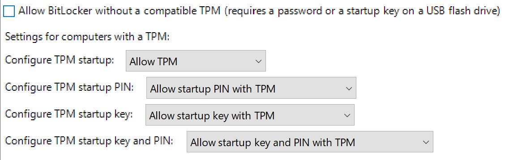
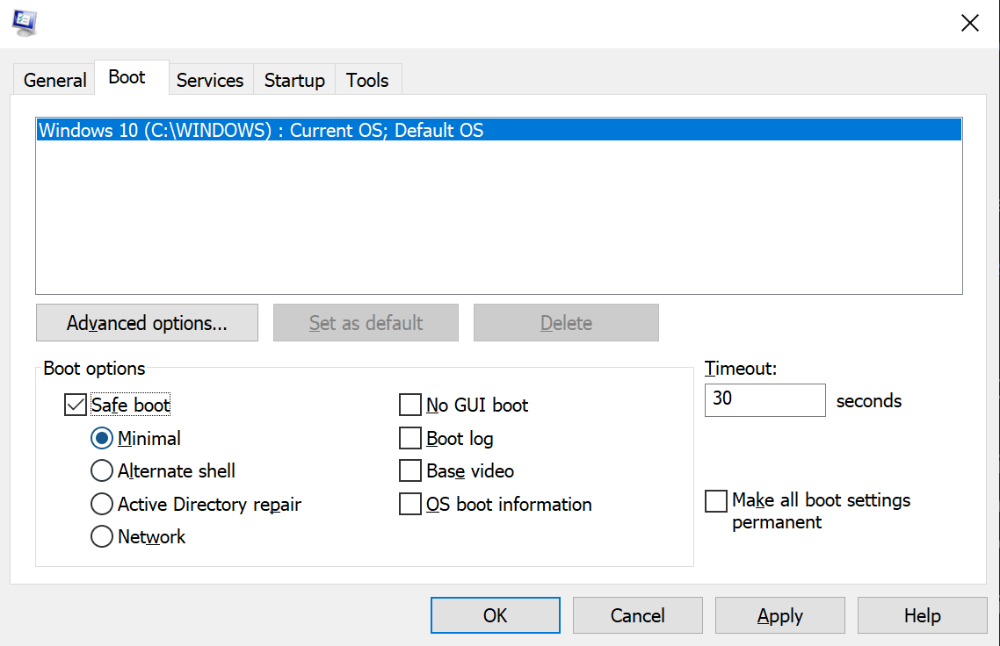

# Windows 10 + Ubuntu (20.04) dual boot and encryption


## Why this guide?

There are lots of guides on installing Ubuntu alongside Windows 10. For my future self and others who may stumble across it, here's yet another one that attempts to gather all the information that I found useful while setting this up - **including enabling encryption for the Ubuntu partition**.

To me, as a consultant having signed countless NDAs, that encryption part is especially important, but wasn't exactly straight forward.

*This guide, for the most part, covers things that aren't  specifically related to Ubuntu, so it is likely relevant for a number of other Linux distros as well.*

My laptop is a Dell XPS 13 9360.

This guide assumes the Windows partition is already protected with BitLocker.

## Overview

In high-level terms, here's how I got this working (more details in dedicated sections below)

1. **Install Windows 10 first**
    * Always start with Windows, then Ubuntu
    * If installing fresh, make room for Ubuntu at install time (and skip step 2 🎉)
2. **Make room for Ubuntu**
    * I chose to split the disk ~50/50
    * Unmovable files sometimes prevent partition shrinking; read more below
3. **Prepare for Ubuntu install**
    1. Prepare install media (USB)
    2. Turn off secure boot in BIOS (have your Windows recovery key ready, or preferably a PIN)
    3. Using Intel Rapid Storage Technology (RST)? Switch to AHCI via BIOS
4. **Try, then install Ubuntu**
    * Create & encrypt partitions using Ubuntu installer GUI
    * Configure logical volumes via terminal
    * Install Ubuntu

## Install Windows 10 first

Ubuntu is happy to be installed alongside Windows. The other way around; not so much, as far as I've been told. Most guides recommend you install Windows first, then Ubuntu.

If you've already got Windows installed and would like to keep that installation as is, then continue on to [step two](#make-room-for-ubuntu) for tips on how to make this happen.

If you're installing Windows 10 fresh, then make room for Ubuntu already at install time, and skip to [step three](#prepare-installation-media-usb).

## Make room for Ubuntu

An existing Windows 10 installation will likely have the whole disk at its disposal. So we have to carve up the disk; some space for Windows and one for Ubuntu.

For this, open **Disk Management** (diskmgmt.msc) in Windows and shrink one or more volumes *(don't touch the EFI or recovery partions or similar)* to free up the necessary space (I went for 50% unallocated space on disk).

### Unmovable files?

You may run into trouble with unmovable files preventing you from shrinking a volume (I did!). By following [this HowToGeek guide for Windows Vista][1] (which works fine for Windows 10 as well) I successfully got around this issue and freed up space for Ubuntu. So far so good.

(As mentioned on HowToGeek, I also had to defragment the disk. I used a 30-day trial of Perfect Disk, but any other disk optimizer will likely do just fine.)

## Prepare installation media (USB)

Get the relevant ISO and create installation media on a USB stick. Read more here:
* [Universal USB Installer](https://www.pendrivelinux.com/universal-usb-installer-easy-as-1-2-3/)
* [Etcher](https://www.omgubuntu.co.uk/2016/10/make-bootable-ubuntu-1610-usb-install-drive-6-easy-steps)

Also, make sure the USB is picked up as a bootable device; this may need to be configured in the BIOS.

## Disable Secure Boot in BIOS

I ran into a couple of things that I needed to change before installing Ubuntu. First, we need to...

### Get a copy of your recovery key

In the control panel, under "BitLocker Drive Encryption" select the "Back up your recovery key" option and print and/or save the key somewhere, if you haven't done so already. Just in case.

### Set up a BitLocker PIN

Again, under **BitLocker Drive Encryption** select **Change how drive is unlocked at startup**, then select **Enter a PIN** to specify a more memorable code (which you'll be required to enter before Windows starts up from now on!)

If these options aren't available to you, you'll need to change some group policy settings in the **Local Group Policy Editor** (gpedit.msc). Go to:

> Local Computer Policy > Computer Configuration > Administrative Templates > Windows Components > Bitlocker Drive Encryption > Operating System Drives

Open the policy **"Require additional authentication at startup"** and set it up like shown here. This should allow you to set the PIN as described above.



### Disable Secure Boot in BIOS

I found [this screenshot guide useful][4].

## Using Intel Rapid Storage Technology? (RST)

If yes, you'll likely need to switch to AHCI in BIOS before you can install Ubuntu. If you don't, the installer will identify any compatibility issues and let you know if you need to do something about it. Give it try before changing anything - in case it just works! 😅

### Switch to AHCI

> **⚠ WARNING. This can be a destructive action depending on your storage configuration.**

I had some issues with this. At first, I just switched to AHCI in BIOS, and Windows wouldn't boot. Changing it back to RST reverted the issue - but I can't say for sure if it would in other situations.

Anyway, I got this working by setting Windows to start up in Safe Mode: Run **msconfig**, and in the Boot tab, put a checkmark in **Safe boot** and **Minimal**.



Then, restart, enter BIOS and switch the storage controller to AHCI mode again. Restart and pray that Windows still boots.

Switch off safe mode again in **msconfig**. Phew, now onto the Ubuntu installation - the fun part starts here 🎈

## Set up Ubuntu volumes and encryption

[This great answer on AskUbuntu][2] guided me through the process of setting up encryption for Ubuntu during installation. I'm copying that step-by-step guide here, modified to instead use the Ubuntu installer's partitioning GUI that is presented when you select "Something else" under "Installation type".

Also, my devices weren't named "sda" or similar, but rather something like "nvme0n1p2". This difference isn't important; what's important is that you reference the right device names in the commands below.

---

Boot Ubuntu from the USB and select the option to "Try Ubuntu" without installing. Follow the steps I've outlined below. Let's assume you're installing to **/dev/sdb**.

1. Partition the drive with your tool of choice (in my case, the Ubuntu install GUI)
    - **other partitions**: existing OSs *-- we don't care about these*
    - **sdb1**: /boot (500MB)
    - **sdb2**: LUKS partition (the remaining free space on disk):
        - in the partition editor, select "Use as: physical volume for encryption"

2. Setup LVM on **/dev/mapper/xxxx_crypt** (substitute with encrypted volume name)

    **Note:** Swap partition is optional. I skipped it on my SSDs due to reasons listed in [this AskUbuntu thread](https://askubuntu.com/questions/652337/why-no-swap-partitions-on-ssd-drives).

    ```
    sudo vgcreate system /dev/mapper/xxxx_crypt
    sudo lvcreate -n swap -L 2G system
    sudo lvcreate -n root -L 20G system
    sudo lvcreate -n home -l +100%FREE system
    ```

3. Now you're ready to install, so run the installer again (use desktop shortcut in Ubuntu)
    * When you get to the "Installation type" portion of the install, choose the "Something else" option. Then manually assign the **/dev/mapper/system-xxx** partitions as you would like to have the configured.
    * Don't forget to set **/dev/sdb1** as /boot. the /boot partition must not be encrypted. If it is, we won't be able to boot. If not already set, change the "Device for boot loader installation" to /dev/sdb, and continue with installation.
 
4. **NOTE:** When installation is complete, **don't reboot**! Choose the option to "Continue Testing".

---
### Post-installation configuration from live OS

This bit is really important if you want your system to boot:

6. In a terminal, type the following and look for the UUID of /dev/sdb2. Take note of that UUID for later.
 
    ```
    sudo blkid | grep LUKS
    ```

    - The important line on my machine reads:
    `/dev/sdb2: UUID="bd3b598d-88fc-476e-92bb-e4363c98f81d" TYPE="crypto_LUKS" PARTUUID="50d86889-02"`

7. Next lets get the newly installed system mounted again so we can make some more changes.

    ```
    sudo mount /dev/system/root /mnt
    sudo mount /dev/system/home /mnt/home
    sudo mount /dev/sdb1 /mnt/boot
    sudo mount --bind /dev /mnt/dev
    sudo mount --bind /run/lvm /mnt/run/lvm
    
    # Only if using EFI
    sudo mount /dev/sd*/your/efi/partition /mnt/boot/efi
    ```

8. Now run `sudo chroot /mnt` to access the installed system
9. From the chroot, mount a couple more things
    
    ```
    mount -t proc proc /proc
    mount -t sysfs sys /sys
    mount -t devpts devpts /dev/pts
    ```

10. Setup crypttab. Using your favorite text editor, create the file **/etc/crypttab** and add the following line, **changing out the UUID with the UUID of your disk.**

    ```
    echo 'CryptDisk UUID=bd3b598d-88fc-476e-92bb-e4363c98f81d none luks,discard' > /etc/crypttab
    ```

11. Lastly, rebuild some boot files.
    - `update-initramfs -k all -c`
    - `update-grub`
12. Reboot, and the system should ask for a password to decrypt on boot!

## Sources

This guide is based on bits and pieces from the following articles. Thanks to all those who took the time to write these things up:

* [How to Install Ubuntu and Windows 8 or 10 as a Dual Boot on your Dell PC](https://www.dell.com/support/article/sln301754)
* [How to Get Around Windows’ “Shrink Volume” Inadequacy Problems (HowToGeek)][1]
* [Encrypted Custom Install (Ask Ubuntu)][2]
* [Dell XPS 9360 Dualboot Windows 10 and Ubuntu 16.04][3]
* [How To Disable UEFI Secure Boot In Windows 8 & 8.1][4]

[1]: https://www.howtogeek.com/howto/windows-vista/working-around-windows-vistas-shrink-volume-inadequacy-problems/
[2]: https://askubuntu.com/a/918030/1078101
[3]: https://askubuntu.com/a/1007584/1078101
[4]: https://itsfoss.com/disable-uefi-secure-boot-in-windows-8/
